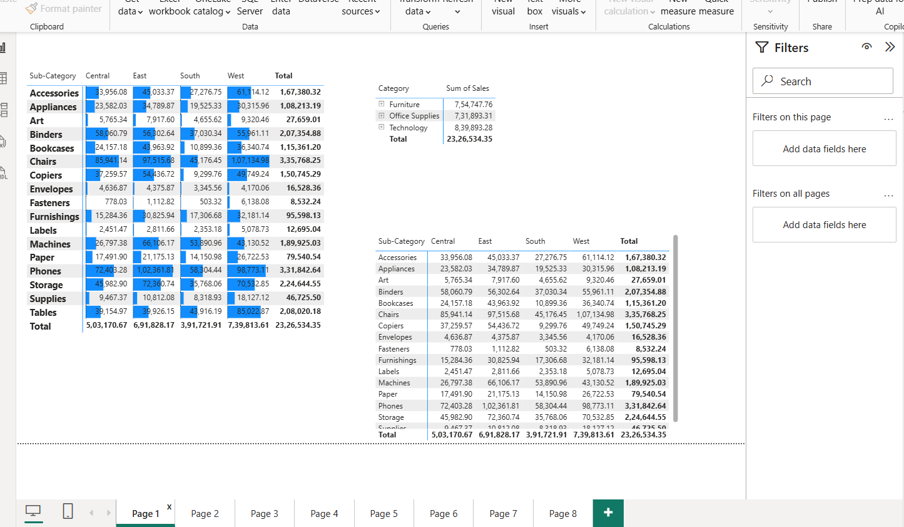

# 📊 Sales Performance Dashboard (Power BI)

## 📌 Project Overview

Developed an interactive business intelligence dashboard to analyze sales performance, profitability, and customer trends using Power BI. The project focuses on transforming raw sales data into actionable insights to support data-driven decision-making.

---

## 🎯 Objectives

* Analyze overall sales and profit performance
* Identify top-performing regions and product categories
* Track sales trends over time
* Enable interactive exploration using filters

---

## 🛠 Tools & Technologies

* **Power BI Desktop**
* **Power Query (ETL operations)**
* **DAX (Data Analysis Expressions)**
* **CSV Dataset (Superstore Sales Data)**

---

## ⚙️ Key Features

* 📌 KPI Cards: Total Sales, Total Profit, Profit Percentage
* 📊 Sales Trend Analysis (Time-series visualization)
* 🌍 Region-wise Sales Performance
* 🛍 Category-wise Contribution Analysis
* 🎛 Interactive Slicers (Region, Category, Date)
* 🔄 Dynamic filtering for real-time insights

---

## 🧠 Key Insights

* Identified high-performing regions contributing maximum revenue
* Observed monthly sales trends and seasonal patterns
* Analyzed profit margins across categories
* Highlighted underperforming segments for business improvement

---
## 📊 Dashboard Preview

  

---

## 📂 Project Files

* `sales_dashboard.pbix` – Power BI dashboard file
* `Sample - Superstore.csv` – Dataset used for analysis

---

## 🚀 Business Impact

This dashboard helps stakeholders:

* Monitor business performance efficiently
* Make data-driven strategic decisions
* Identify growth opportunities and risk areas

---

